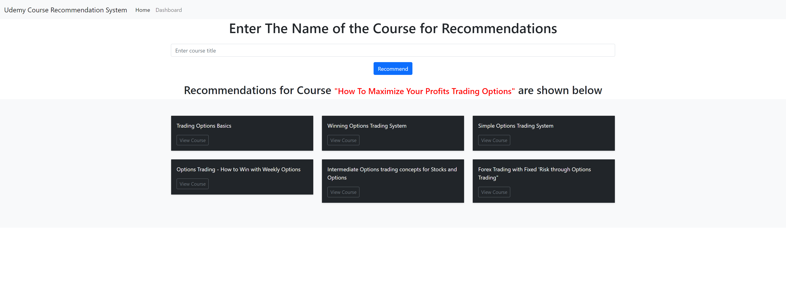
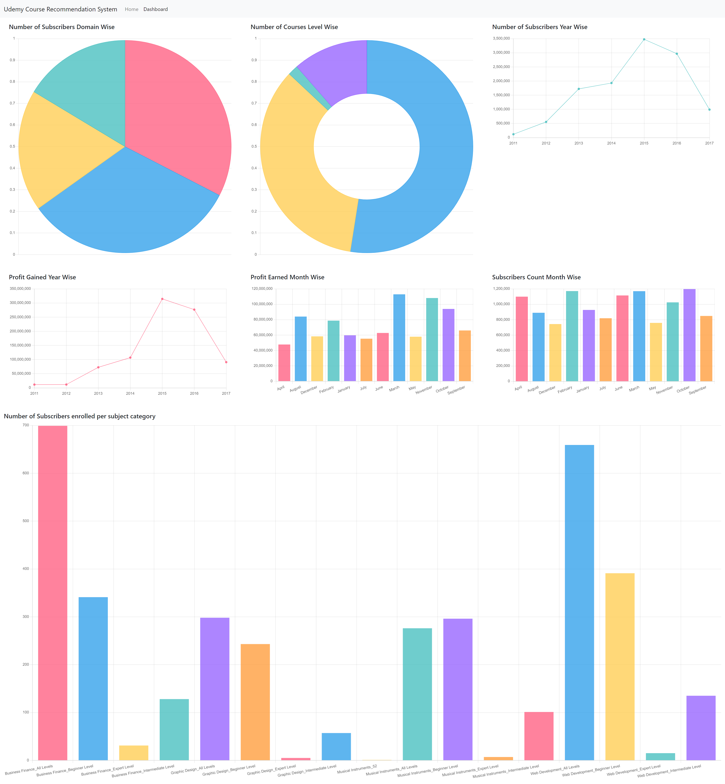

# Udemy Course Recommendation System




## Project Overview

The Udemy Course Recommendation System is a machine learning project that recommends Udemy courses based on user input and provides insightful analytics about the courses. This project uses content-based filtering and cosine similarity to generate course recommendations. The application provides a user-friendly web interface built with Flask, allowing users to search for courses and view detailed analytics about the Udemy course ecosystem.

## Table of Contents

1. [Project Setup](#project-setup)
2. [Dataset](#dataset)
3. [Model Training](#model-training)
4. [Flask Application](#flask-application)
5. [Deployment Options](#deployment-options)
6. [File Structure](#file-structure)
7. [Usage](#usage)

## Project Setup

To set up this project, you'll need:

- Python 3.x installed on your local machine
- Git for version control

Clone the repository:

```
git clone https://github.com/pouryare/udemy-course-recommendation.git
cd udemy-course-recommendation
```

Install the required packages:

```
pip install -r app/requirements.txt
```

## Dataset

The dataset used for this project is the "udemy_course_data.csv" file, which is included in the root folder of the repository. The cleaned version of this dataset, "UdemyCleanedTitle.csv", is located in the `app` folder. Please note that I am not the owner of this dataset; it was downloaded from internet for educational purposes.

## Model Training

The model training process is detailed in the `Course_recommendation_system.ipynb` notebook. This notebook covers data preprocessing, exploratory data analysis, and the implementation of the recommendation system using content-based filtering and cosine similarity.

## Flask Application

The Flask application is defined in `app/app.py`. It provides a user interface for searching courses, viewing recommendations, and exploring course analytics through an interactive dashboard.

## Deployment Options

There are three ways to use this application:

1. **Run Locally**:
   - Navigate to the `app` directory: `cd app`
   - Run the Flask app: `python app.py`
   - Open a web browser and go to `http://localhost:8080`

2. **Deploy on Heroku**:
   - Create a Heroku account and install the Heroku CLI.
   - Navigate to the `app` directory: `cd app`
   - Initialize a Git repository and commit your files.
   - Create a new Heroku app: `heroku create udemy-course-recommendation`
   - Push your code to Heroku: `git push heroku master`

3. **Use Docker**:
   - Build the Docker image: `docker build -t pouryare/udemy-course-recommendation ./app`
   - Run the container: `docker run -p 8080:8080 pouryare/udemy-course-recommendation`

## File Structure

```
udemy-course-recommendation/
├── app/
│   ├── templates/
│   │   ├── dashboard.html
│   │   └── index.html
│   ├── app.py
│   ├── Dockerfile
│   ├── Procfile
│   ├── requirements.txt
│   └── UdemyCleanedTitle.csv
├── Course_recommendation_system.ipynb
├── README.md
├── screenshot-dashboard.png
├── screenshot-home.png
└── udemy_course_data.csv
```

## Usage

1. Open the application (either locally, on Heroku, or via Docker).
2. On the home page, enter a course title or keywords in the search bar.
3. Click the "Recommend" button to view similar courses.
4. Navigate to the Dashboard to explore analytics about the Udemy course ecosystem, including:
   - Number of subscribers by domain
   - Course distribution by level
   - Yearly subscriber growth
   - Profit trends
   - Monthly subscriber and profit patterns

---

This project demonstrates the application of machine learning and data analysis in creating a course recommendation system and providing insights into the Udemy course marketplace. It serves as an excellent example of an end-to-end data science project with a web application interface and multiple hosting options.

For any issues or suggestions, please open an issue on the GitHub repository.

